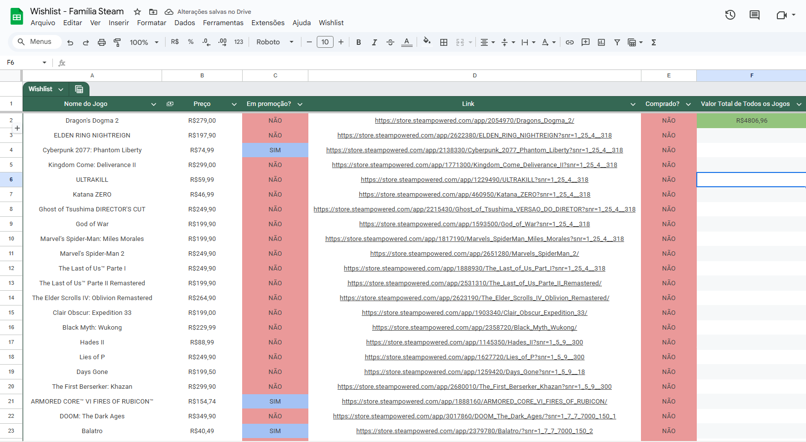
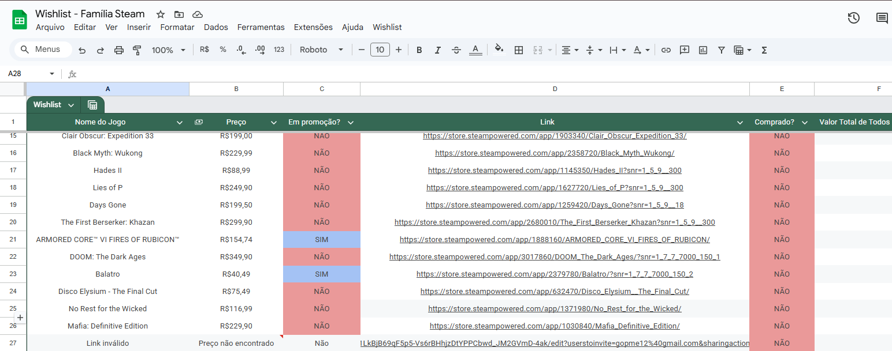

# Steam Wishlist Automática no Google Planilhas

Um projetinho divertido que fiz para organizar, com meus amigos, a lista de desejos da família Steam. Ele usa Google Apps Script para automatizar o preenchimento de informações direto no Google Sheets! A ideia é acompanhar os jogos que queremos comprar e ficar de olho em promoções.

## O que ele faz

- Busca automaticamente o **nome, preço e status de promoção** de jogos da Steam a partir do link.
- Atualiza a planilha todos os dias às 7h da manhã.
- Destaca promoções e jogos já comprados com cores diferentes.
- Adiciona um botão no menu "Wishlist" para atualizar apenas os novos jogos.
- Na imagem vai ter a coluna de "Valor total de todos os jogos", mas adicionei isso na brincadeira para ver o quão caro ia ficar.

## Exemplo

  

## Como usar

1. Crie uma planilha no Google Sheets.
2. Vá em `Extensões > Apps Script`.
3. Cole o conteúdo de `src/code.gs`.
4. Salve e recarregue a planilha.
5. Use o menu `Wishlist > ATUALIZE` para buscar os dados.
6. Execute a função `criarAcionadorDiario()` no console do Apps Script para ativar as atualizações automáticas diárias.
7. Insira os links dos jogos na coluna "Link Steam".

## Estrutura da planilha

| Nome do Jogo    | Preço    | Em Promoção? | Link Steam                                       | Comprado? |
|------------------|-----------|----------------|--------------------------------------------------|-------------|
| The Witcher 3     | R$ 19,99 | SIM           | https://store.steampowered.com/app/292030 | NÃO        |

## Observações

- Evite fazer muitas requisições em pouco tempo para não ser bloqueado pela Steam temporariamente.
- A atualização automática ocorre diariamente às 7h. Caso prefira outro horário, ajuste a função `criarAcionadorDiario`.
- A coluna "Comprado?" aceita “SIM” ou “NÃO”. Se estiver marcado como "SIM", o jogo não será atualizado novamente.

## Licença

MIT — Fique à vontade para usar, modificar ou compartilhar como quiser :)
